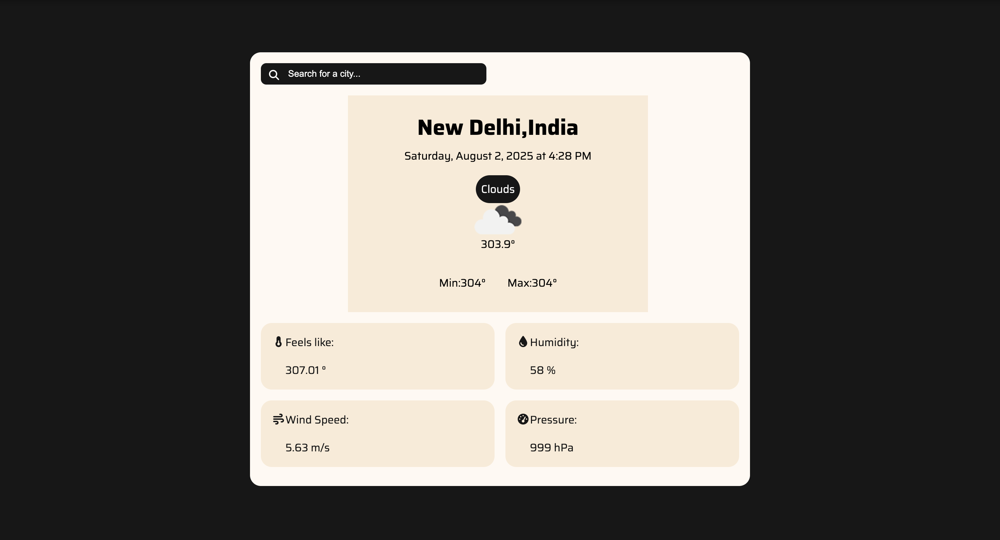

# 🌤️ Weather Forecast Web App

A responsive weather application that displays real-time weather data using the OpenWeatherMap API. This project is built with HTML, CSS, and JavaScript — great for beginners to learn about APIs, DOM manipulation, and async JavaScript.

---

## 📸 Screenshot



---

## 🚀 Live Demo

👉 [Click here to view live](https://piushmaji.github.io/Weather_Report)

---

## ⚙️ Features

- 🔍 Search for current weather by city name
- 🌡️ Displays temperature, min/max, and weather condition
- 📅 Shows current date and time
- 📱 Responsive design for all screen sizes
- 🌈 Clean UI with weather icons

---

## 🧰 Tech Stack

- HTML5
- CSS3
- JavaScript (ES6+)
- OpenWeatherMap API

---

## 🛠️ Getting Started

1. Clone the repository
```bash
git clone https://https://github.com/piushmaji/Weather_Report.git
